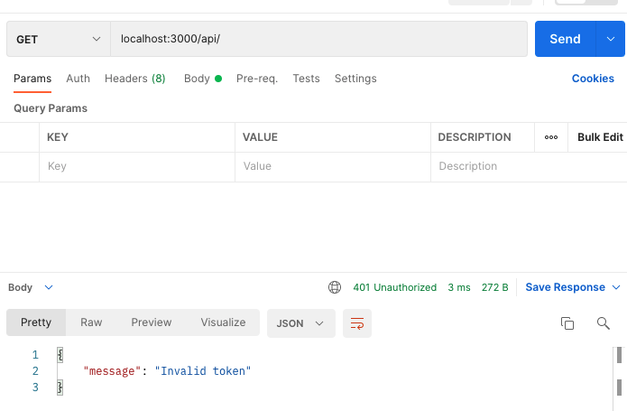
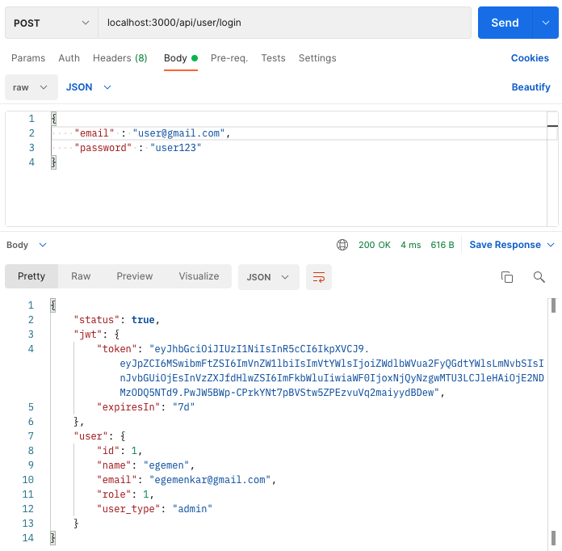
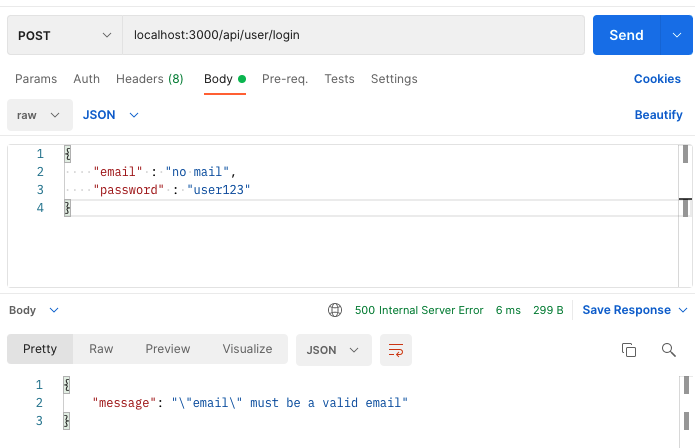
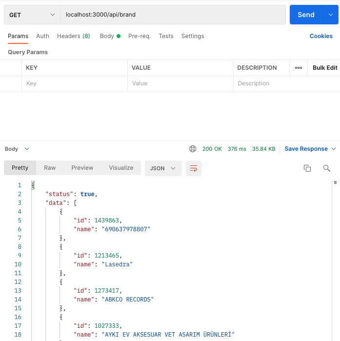
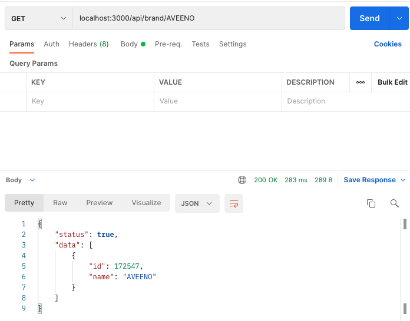
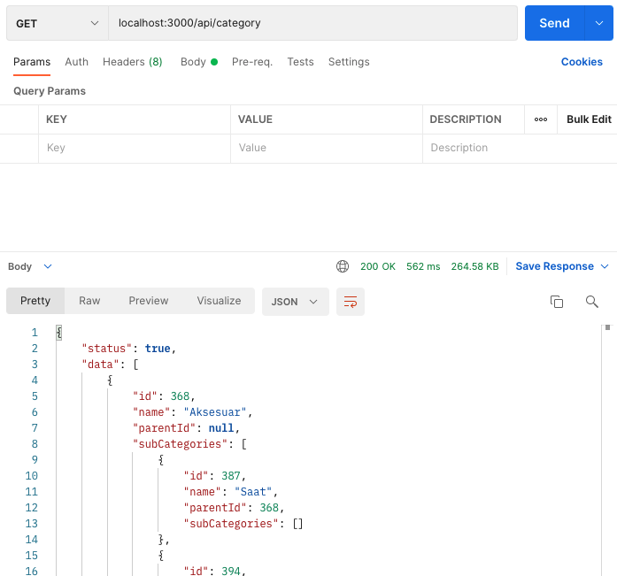
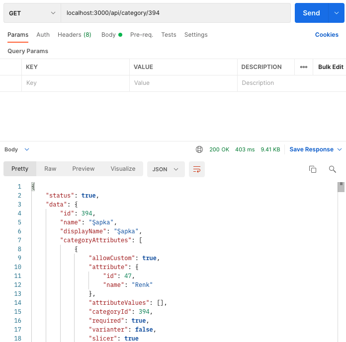

# A101 Bootcamp Homework 2

This repo is created by [Egemen Kar](https://github.com/egemenkar) & [Melih Üstün](https://github.com/ustunmelih) for the second homework assignment of the [A101 Node.js & TypeScript Amazon Lambda & DynamoDB](https://www.patika.dev/bootcamp/a101-amazon-lambda-dynamodb-bootcamp-node-js-typescript-programi) bootcamp.

## Instructions

* JWT integration
* Validation with “joi” before JWT signing
* Trendyol brands GET endpoint and adding query params to this endpoint with id or name
* Trendyol categories GET endpoint
* Trendyol single category GET endpoint
* Error Handler integration

## Installation

Run:

```bash
npm install
```

## Deployment

Run:

```
npx nodemon index.js
```
or

```
node index.js
```
or

```
nodemon index.js
```

## Technologies Used

* Node.js
* Express
* JWT
* Joi
* Axios

## Previews

* JWT and Error Handler Integration

Throws `invalid token` error message unless the path is `/api/user/login`



Successful login return `JWT token values` and `user object`



* Validation with “joi” before JWT signing

Throws `error message` and doesn't validate if the email or password is not valid



* Trendyol brands GET endpoint and adding query params to this endpoint with id or name

Endpoint for fetching all brands from [Trendyol api](https://developers.trendyol.com/tr/urun-entegrasyonu/v2/trendyol-marka-bilgileri)



Endpoint for fetching single brand from [Trendyol api](https://developers.trendyol.com/tr/urun-entegrasyonu/v2/trendyol-marka-bilgileri)



* Trendyol categories GET endpoint

Endpoint for fetching categories from [Trendyol api](https://developers.trendyol.com/tr/urun-entegrasyonu/v2/trendyol-kategori-bilgileri)



Endpoint for fetching single category from [Trendyol api](https://developers.trendyol.com/tr/urun-entegrasyonu/v2/trendyol-kategori-bilgileri)



## Licence

[MIT.](license)


